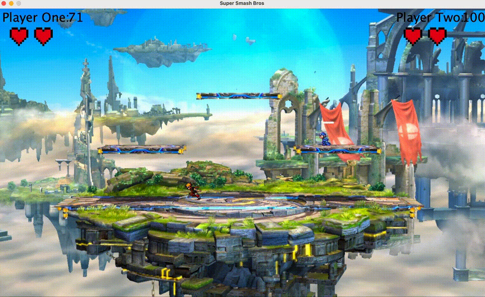
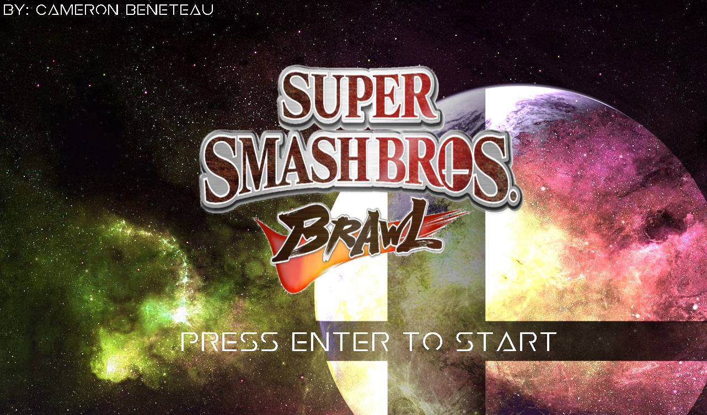
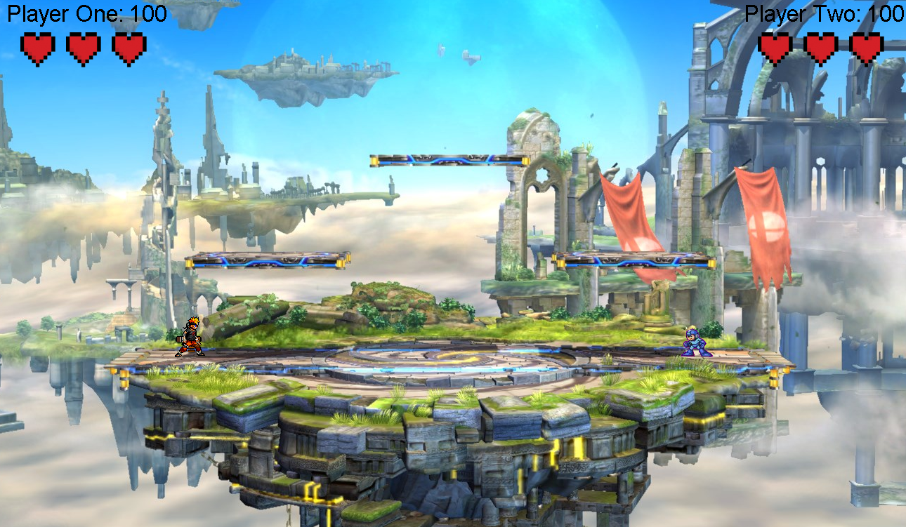

# Super Smash Bros

A two-player remake of the classic fighting game [Super Smash Bros](https://www.smashbros.com/)! Made in 24 hours using Java Swing! ([Demo Video](https://youtu.be/xzXVgzSy6KA))

Event: [MasseyHacks IV](https://mh4.masseyhacks.ca/) (Grade 11)  
Date: April 28-29, 2018

## Table of Contents
[1. Intro](#Intro)  
[2. Gameplay](#Gameplay)  
[3. Environment Setup](#Environment-Setup)  
[4. How to Play](#How-to-Play)  
[5. Results](#Results)  
[6. Next Steps](#Next-Steps)

## Intro

This is a two-player crossover fighting game inspired by the classic arcade game [Super Smash Bros](https://en.wikipedia.org/wiki/Super_Smash_Bros.).

This game was made using Java. It utilizes object-oriented programming and other computing techniques learned throughout high school.

## Gameplay

Check out the demo video for this project [here](https://youtu.be/xzXVgzSy6KA)!

  

## Environment Setup

To successfully run this project, please follow these steps to set up your environment:

1. Any IDE that runs Java (I recommend [IntelliJ IDEA](https://www.jetbrains.com/idea/), [JCreator](https://www.deepcrazyworld.com/how-to-download-jcreator-pro/) or [VS Code](https://code.visualstudio.com/download))
2. Java SE 8 (which includes JDK 1.8.0_333) ([Download from Oracle](https://www.oracle.com/java/technologies/javase/javase8u211-later-archive-downloads.html))
3. Ensure your IDE is configured to use the above version of Java SE and JDK

## How to Play

All instructions can be found in the game after pressing 'ENTER' on the main screen.

Run the [Smash.java](Smash.java) file to play!

## Results

I am extremely happy I was able to participate in MasseyHacks IV to build this project.

The 24-hour time constraint was easily the hardest but most enjoyable part of this experience.

It was a big challenge to try to build a game this fast, but it kept me on my feet and forced me to think of neat and creative ways to overcome the various challenges I faced through this development process.

There are definitely some things I would like to go back and change/clean up!

Although this game did not win any prizes at the hackathon, it was awesome to see my creation come to life - especially after letting the judges and other hackers play against each other!

## Next Steps
Some fun things I would like to build on or explore relating to this project would be:

- Develop enemy AI characters for users to play against
- Allow players to choose various characters
- Have multiple types of attacks and combos
- Add sound effects to various in-game events (attack, jump, death, etc.)
